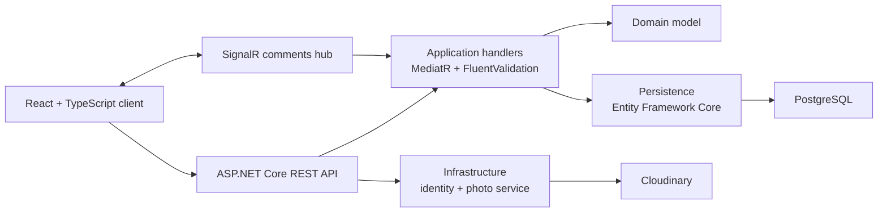

# Hexanet

> Historical learning project · October–November 2021 · Not actively maintained

Hexanet is a full-stack social activity app. Users can register, create and join activities, manage profiles and photos, follow other users, and discuss an activity through live comments.

This repository records my implementation of the project from Neil Cummings's [Complete guide to building an app with .NET Core and React](https://www.udemy.com/course/complete-guide-to-building-an-app-with-net-core-and-react/) course. The course supplied the central product and architecture. I renamed and branded my implementation as Hexanet and used it to learn how a typed React client, a layered ASP.NET Core API, persistence, authentication, and real-time updates fit together.

It is kept as evidence of an earlier stage of my engineering work. It is not an original production product or a current reference architecture.

## What the snapshot includes

- Account registration and JWT authentication with ASP.NET Core Identity
- Activity creation, editing, deletion, attendance, filtering, and pagination
- User profiles, photo upload and cropping, and follower relationships
- Real-time activity comments through SignalR
- React forms, validation, error handling, loading states, and MobX stores
- Entity Framework Core persistence with PostgreSQL deployment support

## Architecture



| Area | 2021 implementation |
| --- | --- |
| Client | React 17, TypeScript, MobX, React Router, Formik, Semantic UI |
| API | C#, ASP.NET Core 5, ASP.NET Core Identity, JWT |
| Application layer | MediatR, FluentValidation, AutoMapper |
| Data | Entity Framework Core, PostgreSQL |
| Live and media features | SignalR, Cloudinary |

## Repository map

- [`client-app`](client-app) — React and TypeScript interface
- [`API`](API) — HTTP API, authentication, middleware, and SignalR hub
- [`Application`](Application) — use-case handlers, validation, mapping, and interfaces
- [`Domain`](Domain) — activities, users, comments, photos, and relationships
- [`Persistence`](Persistence) — EF Core context, migrations, and sample data
- [`Infrastructure`](Infrastructure) — current-user and photo-service adapters

## Historical reproduction

The project targets .NET 5 and Create React App 4. Both are obsolete. Use an isolated development environment, and do not deploy this snapshot as a production service.

The original local setup used:

- .NET 5 SDK
- A Node.js version compatible with Create React App 4
- PostgreSQL
- A Cloudinary account for photo features

Create local configuration from the safe examples:

```bash
cp API/appsettings.Development.example.json API/appsettings.Development.json
cp client-app/.env.example client-app/.env.development.local
```

Then add local-only values and start the two applications:

```bash
dotnet restore
dotnet run --project API
```

```bash
cd client-app
npm ci
npm start
```

I have not modernized the dependencies or verified a fresh installation on a current toolchain. The preserved source and commit history are the main purpose of this repository.

## What I learned

This project was my first sustained pass through a complete React and .NET application. It gave me practical experience with API boundaries, server-side authorization, client state, data modeling, asynchronous UI states, real-time connections, and the difference between code that works locally and code that is ready to deploy.
